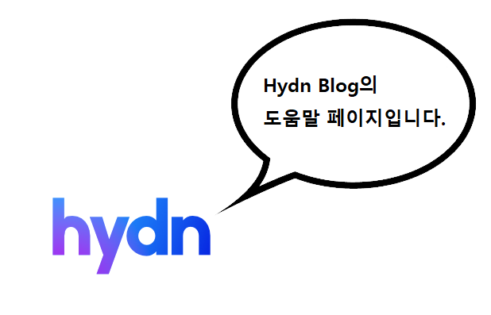

<html>
    <head> 
            <meta charset = 'utf-8'/>
            <link rel = "stylesheet" href="../css/about_style.css">
            <link rel = "stylesheet" href="../css/style.css">
    </head>
    <body>
           
        

             
        

         
 
        

            <h3>※ 블로그 편집자 정보</h3> 
            &nbsp; &nbsp;
            
        

        

            
 
                <strong>이름</strong> : 손○○   
                <strong>E-mail</strong> : ""   
                <strong>소속</strong> : ○○○○대학교 컴퓨터공학과  
            

            
 
                <strong>이름</strong> : 이○○   
                <strong>E-mail</strong> : ""   
                <strong>소속</strong> : ○○○○대학교 컴퓨터공학과  
            

            
 
                <strong>이름</strong> : 최○○   
                <strong>E-mail</strong> : ""   
                <strong>소속</strong> : ○○○○대학교 컴퓨터공학과  
            

        

         
 
        

            <h3>※ NavBar 기능과 사용</h3>
            &nbsp; &nbsp;
            
        

        

            
 
                <strong>1. Home &nbsp;  </strong>
                
&nbsp;&nbsp;&nbsp;&nbsp; - 블로그의 메인화면으로 이동합니다.

                
&nbsp;&nbsp;&nbsp;&nbsp; - 사용자가 지정한 블로그의 Feature Post가 출력됩니다.

            

             
            
 
                <strong>2. About &nbsp;  </strong>
                
&nbsp;&nbsp;&nbsp;&nbsp; - 블로그의 도움말 페이지로 이동합니다.

            

             
            
 
                <strong>3. Category Post &nbsp;  </strong>
                
&nbsp;&nbsp;&nbsp;&nbsp; - 카테고리 별 포스트를 출력하는 화면으로 이동합니다.

                
&nbsp;&nbsp;&nbsp;&nbsp; - 카테고리 별로 포스트이 작성날짜에 따라 배열됩니다.

            

             
            
 
                <strong>4. All post &nbsp;  </strong>
                
&nbsp;&nbsp;&nbsp;&nbsp; - 모든 포스트를 출력합니다.

                
&nbsp;&nbsp;&nbsp;&nbsp; - 작성날짜에 따라 포스트들이 배열됩니다.

            

             
            
 
                <strong>5. Tag 별 post &nbsp;  </strong>
                
&nbsp;&nbsp;&nbsp;&nbsp; - 태그(주제)별 도움말 페이지로 이동합니다.

                
&nbsp;&nbsp;&nbsp;&nbsp; - 주제별로 작성된 포스트들의 대표내용이 모두 출력됩니다.

            

        

          
        
 편집자 손* 

        
 편집자 이* 

        
 편집자 최* 

    </body>
</html>